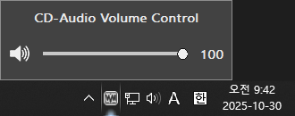

# Direct-WinMM: Play CD Audio via DirectSound / WASAPI

**Direct-WinMM** is a DirectSound/WASAPI-based wrapper for `winmm.dll`, used by many older games and programs to play CD-DA audio tracks.
This program emulates CD-DA playback by playing supported audio files (`.wav`, `.mp3`, `.ogg`, `.flac`) instead of actual audio tracks from a CD-ROM.

# How to Use

1.  Copy `winmm.dll` (and `WinmmVol.exe`, if volume control is desired) into the folder where the game's or program's executable is located.

2.  Rip your audio tracks as `.wav`, `.mp3`, `.ogg`, or `.flac` files.

3.  The program searches for audio files in a subfolder using the format: `[Subfolder]/[Prefix]NN.[wav|mp3|ogg|flac]`.
    * Example: `./Subfolder/Prefix01.wav`
    * `NN` represents the two-digit track number (e.g., 02, 03, 04...).
    * Track 1 is typically data, so audio playback usually starts from Track 02.

4.  **Recommended Setup:** The program gives **highest priority** to the following path:
    `[GameFolder]/Music/TrackNN.[wav|mp3|ogg|flac]`
    * Example: `C:/Games/MyGame/Music/Track02.mp3`

5.  If audio is not playing, ensure your files are named and placed according to this priority structure (`Music/TrackNN...`).

6.  Enjoy your game!

## File Descriptions

* **`winmm.dll`**: The core wrapper file. It intercepts CD-DA commands and emulates them by playing audio files.
* **`WinmmVol.exe`**: The volume control utility.

The core CD audio emulation will function correctly with only `winmm.dll`. However, `WinmmVol.exe` is required to use Direct-WinMM's volume control features.

## Volume Control Utility (WinmmVol.exe)

When the program detects a CD audio control action, it will automatically launch `WinmmVol.exe`.
`WinmmVol.exe` registers itself as a Windows tray icon. Clicking on the icon will display a volume slider to control the CD audio playback level.

## System Requirements

* Minimum OS: Windows XP or later
    * **WASAPI** is available on Windows Vista or later.
    * On Windows XP, playback uses **DirectSound**.
* [DirectX End-User Runtime](https://www.microsoft.com/en-us/download/details.aspx?id=8109)

---

# How the Program Works

Windows prioritizes loading DLL files located in the same folder as the executable when a DLL is requested.
Therefore, the target program loads the local `winmm.dll`--used for MCI commands--from the folder where the custom `winmm.dll` has been placed.

**Direct-WinMM** forwards all non-CD-DA commands to the system's original `winmm.dll`.
When a **CD-DA** command is detected, Direct-WinMM handles it internally using **WASAPI** (on Vista and later) or **DirectSound** (fallback, including XP). By default, WASAPI shared mode is preferred when available to maximize compatibility.

Unlike many existing `winmm.dll` wrappers, Direct-WinMM correctly implements **Notify** and **Wait** semantics to match the original Windows behavior.
Additionally, when the target program requests **status information** (e.g., playback state or current position) via MCI commands, Direct-WinMM returns results consistent with the original `winmm.dll`.

## Volume Behavior (WASAPI)

When the WASAPI path is active, CD-DA playback runs **independently of the target application's volume**.
* Changing the app's mixer slider does **not** affect CD audio.
* Calls to `waveOutSetVolume` do **not** change the CD audio volume (that API targets the legacy waveOut path).
Use the **system/device volume** (or Direct-WinMM's own volume control) to adjust CD-DA playback loudness.

---

# Build Guide

* Build using **Visual Studio 2022** on **Windows**
* Navigate to:
    `Menu > Tools (T) > Get Tools and Features (T)`
    Go to the **Individual components** tab, search for **v141**, and update **x86-related tools**
* Install **Windows SDK 7.1A** (for XP/legacy headers & libs if needed)
* Install **DirectX SDK** (for legacy DirectSound headers & libs)

## SDKs

* [Windows SDK 7.1A](https://www.microsoft.com/en-us/download/details.aspx?id=8442)
* [DirectX SDK](https://www.microsoft.com/en-us/download/details.aspx?id=6812)

## Dependent Libraries

* [minimp3](https://github.com/lieff/minimp3.git)
* [libogg](https://github.com/gcp/libogg.git)
* [libvorbis](https://github.com/xiph/vorbis.git)
* [libflac](https://github.com/xiph/flac.git)
* [libsamplerate](https://github.com/libsndfile/libsamplerate.git)

---

# Referenced Projects

- [AheadLib (by Xjun)](https://github.com/strivexjun/AheadLib-x86-x64.git)
- [ogg-winmm (by hifi)](https://github.com/hifi-unmaintained/ogg-winmm.git)
- [ogg-winmm (by AyuanX)](https://github.com/ayuanx/ogg-winmm.git)
- [cdaudio-winmm (by dippy-dipper)](https://github.com/dippy-dipper/cdaudio-winmm.git)
- [cdaudio-winmm (by YELLO-belly)](https://github.com/YELLO-belly/cdaudio-winmm.git)
